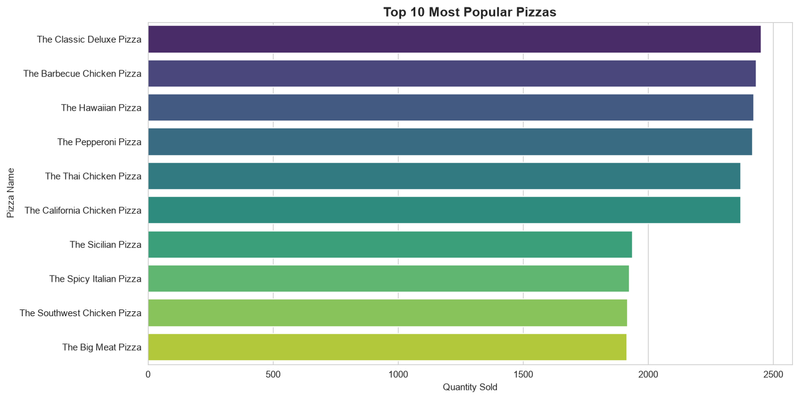
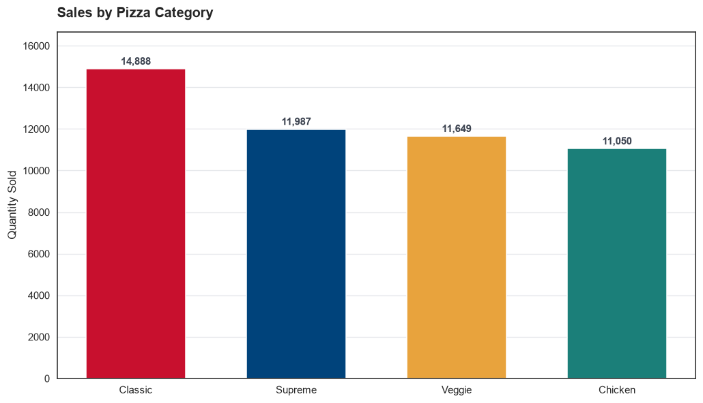
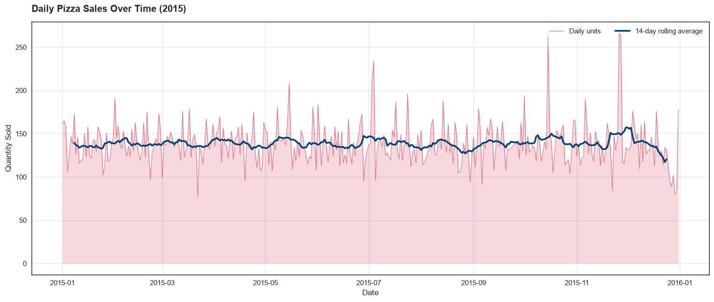
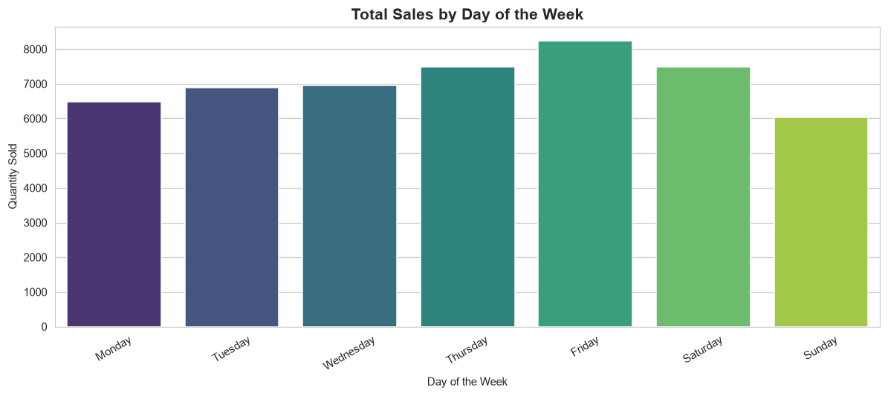
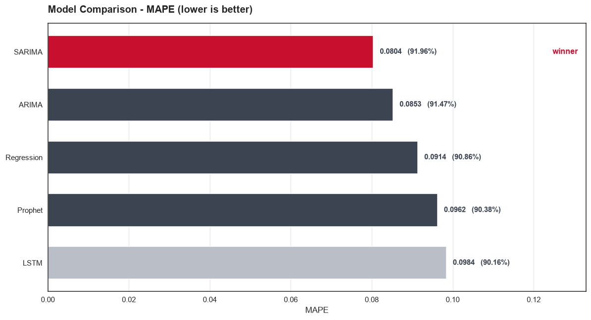
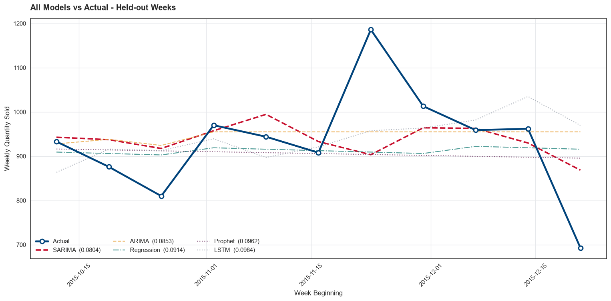
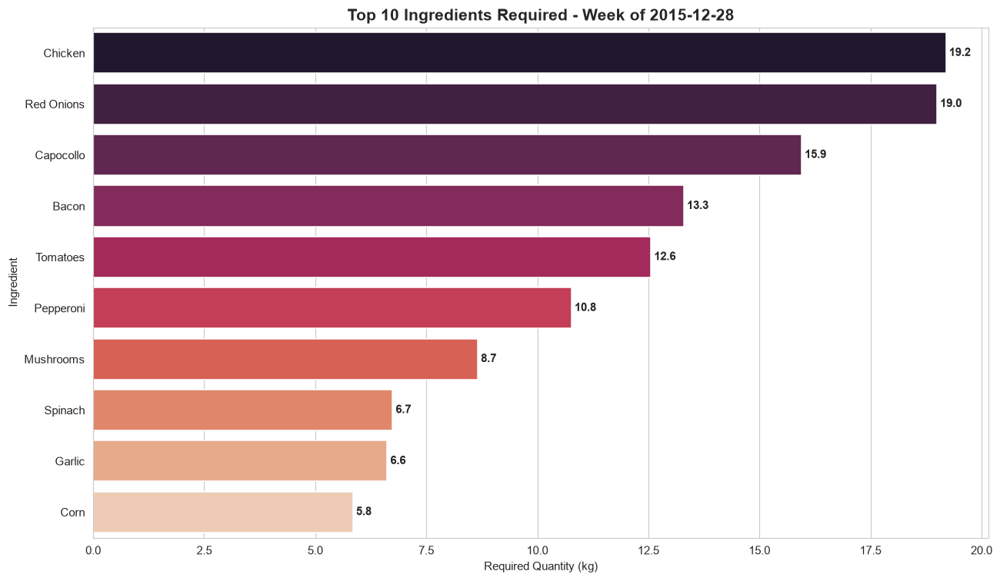

# Domino's - Predictive Purchase Order System

**Forecasting pizza demand to generate an ingredient purchase order.**


---

## Problem Statement

Domino's wants to optimise the process of ordering ingredients by predicting future sales and
creating a purchase order. Order too little and you get stockouts and lost sales; order too much
and fresh ingredients spoil. Both are expensive.

This project uses a year of historical transaction data and a per-pizza ingredient table to
forecast demand and turn that forecast into a concrete purchase order, measured in kilograms.

## Objectives

1. Develop a predictive model to forecast pizza sales.
2. Create a purchase order system that calculates required ingredient quantities from the forecast.

## Business Use Cases

- **Inventory Management** - keep stock levels matched to real demand.
- **Cost Reduction** - cut waste from expired or excess inventory.
- **Sales Forecasting** - anticipate demand to inform strategy and promotions.
- **Supply Chain Optimization** - align ordering with predicted demand.

---

## Results at a Glance

| | |
|---|---|
| **Best model** | **SARIMA** |
| **MAPE** | **0.0804** (91.96% accuracy) |
| **Forecast week** | 2015-12-28 to 2016-01-03 |
| **Pizzas forecast** | 1,085 units across 91 pizza types |
| **Purchase order** | 64 ingredients, **198.79 kg** total |
| **Heaviest line item** | Chicken (19.2 kg) |

---

## Dataset

Two source files, both downloaded from the project's original spreadsheets and committed
unmodified under `data/raw/`.

| Dataset | Rows | Columns | Description |
|---|---|---|---|
| `pizza_sales.csv` | 48,620 | 12 | One row per pizza sold during 2015 |
| `Pizza_ingredients.csv` | 518 | 4 | Grams of each ingredient per pizza |

**Sales fields:** `pizza_id`, `order_id`, `pizza_name_id`, `quantity`, `order_date`, `order_time`,
`unit_price`, `total_price`, `pizza_size`, `pizza_category`, `pizza_ingredients`, `pizza_name`

**Ingredient fields:** `pizza_name_id`, `pizza_name`, `pizza_ingredients`, `Items_Qty_In_Grams`

The data covers **1 January - 31 December 2015**, 358 trading days,
32 distinct pizzas in 91 size variants.

---

## Approach

### 1. Data Cleaning

Both files ship with missing values. Every gap was **reconstructed rather than dropped** - each
dropped row would be a real sale, and deleting it would bias the demand signal downward.

| Column | Missing | How it was recovered |
|---|---|---|
| `total_price` | 7 | Recomputed as `unit_price x quantity` |
| `pizza_category` | 23 | Looked up from `pizza_name_id` |
| `pizza_ingredients` | 13 | Looked up from `pizza_name` |
| `pizza_name` | 7 | Looked up from the ingredient string |
| `pizza_name_id` | 16 | Rebuilt from the `(pizza_name, pizza_size)` pair |
| `Items_Qty_In_Grams` | 4 | Mean gram-weight of that pizza's other ingredients |

**Result: 48,620 of 48,620 sales rows retained.** Zero rows dropped.

One subtlety worth noting: `pizza_name_id` encodes *both* recipe and size (`bbq_ckn_l` is a
**large** Barbecue Chicken). So it cannot be recovered from the name alone - the `(name, size)`
pair is required.

### 2. Feature Engineering

- **Date parsing.** `order_date` mixes two formats - `d/m/Y` for days 1-12 and `d-m-Y` for days
  13-31, a spreadsheet export artefact. Both are day-first; a parser trying each format in turn
  recovers all 48,620 dates with zero failures.
- **Calendar features** - day of week, month, ISO week, year.
- **Holiday flag** - US public holidays.
- **Promotion flag** - weekends, per the project brief.

### 3. Exploratory Data Analysis

| | |
|---|---|
|  |  |
|  |  |

Three findings shaped the modelling:

- **No runaway bestseller.** The top five pizzas sit within 3.5% of each other, so ingredient
  planning has to cover the whole menu rather than optimise for a few stars.
- **The weekend assumption in the brief does not hold.** Weekends average **130 units/day
  against 142 on weekdays**. Friday is the peak at 165, and **Sunday is the weakest day of the
  week** at 116 - the opposite of a weekend uplift. The flag is kept because the brief calls for
  it, but it reads as a weak *negative* signal. Holidays are the real uplift: 169/day vs 138.
- **Seasonality is mild.** July is the strongest month and October the weakest, a spread of only
  ~13%, so most predictable signal lives in week-to-week movement.

### 4. Sales Prediction

The purchase order covers one week, so the series is aggregated to **weekly totals**.

Two data decisions that materially affect the result:

- **The truncated weeks at both ends are dropped.** The data starts 1 Jan and ends 31 Dec, and
  neither lands on a week boundary - so the first and last buckets hold only 4 in-range days
  each, totalling 591 and 442 units against a full-week mean of **952**. Left in, they would
  teach every model a slump and a collapse that never happened. The test used is *date-range
  coverage*, not days-with-sales: some complete weeks contain a genuine zero-sales day (the
  store was shut on Christmas Day), and that is real demand information worth keeping.
- **The train/test split is chronological**, never shuffled - the model always predicts forward
  in time, exactly as it would in production.

Five models were trained on identical data and scored with the same metric on the same held-out
weeks:

| Model | MAPE | Rank | Accuracy (1-MAPE) | Best/Worst |
|---|---|---|---|---|
| SARIMA | 0.0804 | 1 | 91.96% | Best |
| ARIMA | 0.0853 | 2 | 91.47% | nan |
| Regression | 0.0914 | 3 | 90.86% | nan |
| Prophet | 0.0962 | 4 | 90.38% | nan |
| LSTM | 0.0984 | 5 | 90.16% | Worst |





### 5. Purchase Order Generation

The winning model is **refitted on the full year** before forecasting - the split's job was to
choose the model, and once chosen it should learn from every week available, including the most
recent months.

Forecasting happens at the **`pizza_name_id`** level (91 series) rather than by pizza name.
This is what makes the gram totals correct: a large pizza uses more of every ingredient than a
small one, so forecasting "Barbecue Chicken" as a single number would lose the size mix that
determines the actual ingredient bill.

The arithmetic is then straightforward:

```
required grams  =  SUM over pizza types ( grams per pizza  x  forecast units )
```



---

## Purchase Order - Week of 2015-12-28

Top 15 of 64 ingredients. Full order in
[`outputs/purchase_order_next_week.csv`](outputs/purchase_order_next_week.csv).

| Item_No | Ingredient | Required_Quantity_Grams | Required_Quantity_Kg |
|---|---|---|---|
| 1 | Chicken | 19,200.0 | 19.2 |
| 2 | Red Onions | 19,000.0 | 19.0 |
| 3 | Capocollo | 15,950.0 | 15.9 |
| 4 | Bacon | 13,300.0 | 13.3 |
| 5 | Tomatoes | 12,560.0 | 12.6 |
| 6 | Pepperoni | 10,770.0 | 10.8 |
| 7 | Mushrooms | 8,660.0 | 8.7 |
| 8 | Spinach | 6,735.0 | 6.7 |
| 9 | Garlic | 6,615.0 | 6.6 |
| 10 | Corn | 5,850.0 | 5.8 |
| 11 | Mozzarella Cheese | 4,940.0 | 4.9 |
| 12 | Calabrese Salami | 4,450.0 | 4.5 |
| 13 | Beef Chuck Roast | 3,920.0 | 3.9 |
| 14 | Red Peppers | 3,755.0 | 3.8 |
| 15 | Goat Cheese | 3,360.0 | 3.4 |

### Forecast demand by pizza type (top 10)

| pizza_name_id | pizza_name | pizza_size | predicted_quantity |
|---|---|---|---|
| big_meat_s | The Big Meat Pizza | S | 53 |
| classic_dlx_m | The Classic Deluxe Pizza | M | 31 |
| five_cheese_l | The Five Cheese Pizza | L | 28 |
| four_cheese_l | The Four Cheese Pizza | L | 26 |
| pepperoni_l | The Pepperoni Pizza | L | 25 |
| ital_supr_m | The Italian Supreme Pizza | M | 24 |
| cali_ckn_l | The California Chicken Pizza | L | 23 |
| spicy_ital_l | The Spicy Italian Pizza | L | 23 |
| southw_ckn_l | The Southwest Chicken Pizza | L | 22 |
| bbq_ckn_l | The Barbecue Chicken Pizza | L | 22 |

Full forecast in [`outputs/next_week_sales_forecast.csv`](outputs/next_week_sales_forecast.csv).

---

## Project Structure

```
Dominos-Predictive-Purchase-Order-System/
+-- data/
|   +-- raw/                     Source datasets, unmodified
|   |   +-- pizza_sales.csv
|   |   +-- Pizza_ingredients.csv
|   +-- processed/               Deliverable 1: cleaned datasets
|       +-- cleaned_pizza_sales.csv
|       +-- cleaned_pizza_ingredients.csv
+-- notebooks/
|   +-- dominos_predictive_purchase_order_system.ipynb
+-- models/
|   +-- best_sales_model.pkl     Winning model, refitted on the full year
+-- outputs/
|   +-- figures/                 22 charts (01-22)
|   +-- model_comparison.csv     Deliverable 2: metrics
|   +-- next_week_sales_forecast.csv
|   +-- purchase_order_next_week.csv     Deliverable 3: the purchase order
|   +-- purchase_order_summary.csv
+-- reports/
|   +-- project_report.md        Deliverable 4: methodology and findings
|   +-- Dominos - Predictive Purchase Order System.pptx   18-slide presentation
+-- requirements.txt
+-- README.md
```

---

## Running It Yourself

```bash
git clone https://github.com/naveen-pulivarti/Dominos-Predictive-Purchase-Order-System.git
cd Dominos-Predictive-Purchase-Order-System

python -m venv venv
venv\Scripts\activate          # Windows
# source venv/bin/activate      # macOS / Linux

pip install -r requirements.txt
jupyter notebook notebooks/dominos_predictive_purchase_order_system.ipynb
```

Run all cells. The notebook regenerates every CSV, figure and the saved model from the raw data.
Runtime is roughly 20-30 minutes, most of it in the SARIMA grid search and the per-pizza fits.

---

## Deliverables

| # | Deliverable | Location |
|---|---|---|
| 1 | Cleaned and preprocessed datasets | `data/processed/` |
| 2 | Predictive model with code and evaluation metrics | `notebooks/`, `outputs/model_comparison.csv`, `models/` |
| 3 | Detailed purchase order for the next week | `outputs/purchase_order_next_week.csv` |
| 4 | Project report - methodology, findings, business implications | `reports/project_report.md` |

Plus an 18-slide presentation walking through the project end to end:
[`reports/Dominos - Predictive Purchase Order System.pptx`](reports/) - built from the same
output files as this README, with speaker notes on every slide.

---

## Limitations

Stated plainly, because they bound how far the result should be trusted:

- **One year of data.** Annual seasonality cannot be learned from a single cycle - only weekly and
  monthly variation.
- **Model selection used the holdout.** Hyperparameters were chosen by test-set MAPE, so the
  reported figure is mildly optimistic as an estimate of true future error.
- **The order assumes zero opening stock**, no wastage allowance and no supplier pack sizes. A
  production system would layer those on top of this forecast.

---

## Tech Stack

Python 3.12 | pandas | NumPy | Matplotlib | Seaborn | statsmodels (ARIMA/SARIMA) |
Prophet | scikit-learn | TensorFlow/Keras (LSTM)
